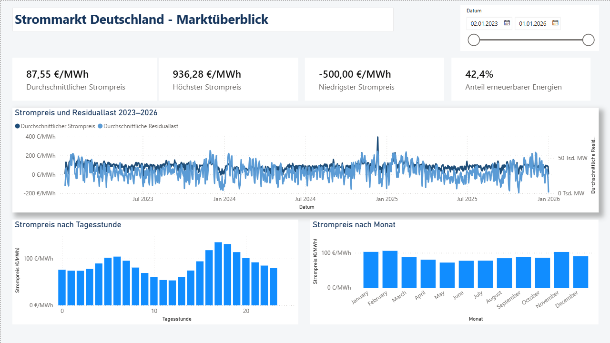

# Energy Market Analytics Dashboard

Kleines Versuchs- und Demonstrationsprojekt zur Analyse des deutschen Strommarktes mit Python, SQLite und Power BI.

Das Projekt dient dazu, einen praktischen Data-Analytics-Workflow von der Datenerfassung über die Datenaufbereitung und Speicherung bis zur interaktiven Visualisierung umzusetzen und verschiedene Analysemöglichkeiten im Bereich der Energiedaten zu untersuchen.

> **Hinweis:** Das Projekt befindet sich noch in Entwicklung und wird laufend erweitert und angepasst. Es handelt sich bewusst um ein kleines Demonstrationsprojekt und nicht um eine vollständig produktionsreife Datenpipeline.

## Überblick

Der deutsche Strommarkt ist durch starke zeitliche Schwankungen von Strompreisen, Stromnachfrage und erneuerbarer Stromerzeugung geprägt.

In diesem Projekt werden historische Daten des deutschen Strommarktes genutzt, um verschiedene zeitliche Muster und Zusammenhänge zu untersuchen. Die Daten werden über die Energy-Charts API abgerufen, mit Python verarbeitet und in einer SQLite-Datenbank gespeichert. Anschließend werden die aufbereiteten Daten in einem interaktiven Power-BI-Dashboard visualisiert.

Der Schwerpunkt liegt dabei weniger auf einer vollständigen wissenschaftlichen Untersuchung als auf der praktischen Umsetzung eines kleinen End-to-End-Datenanalyseprojekts.

## Dashboard

Das zentrale Ergebnis des Projekts ist ein interaktives Power-BI-Dashboard zur Analyse des deutschen Strommarktes.



Das Dashboard umfasst unter anderem:

* Durchschnittlichen Strompreis
* Minimalen und maximalen Strompreis
* Entwicklung des Strompreises über die Zeit
* Strompreis nach Tagesstunde
* Monatliche Strompreismuster
* Residuallast
* Erzeugung aus erneuerbaren Energien
* Interaktive Filterung nach Zeiträumen

Das Dashboard wird im weiteren Verlauf des Projekts kontinuierlich erweitert und angepasst.

## Datenpipeline

Die Datenverarbeitung ist derzeit als Abfolge von Jupyter-Notebooks aufgebaut.

```text
Energy-Charts API
        │
        ▼
Datenerfassung
        │
        ▼
Datenaufbereitung
        │
        ▼
Feature Engineering
        │
        ▼
SQLite-Datenbank
        │
        ▼
Power BI Dashboard
```

Die einzelnen Notebooks werden nacheinander bearbeitet. Die erzeugten Daten werden zwischen den einzelnen Verarbeitungsschritten gespeichert und anschließend für die weiteren Schritte verwendet.

### 1. API-Test

`00_api_test.ipynb`

Überprüfung der Verbindung zur Energy-Charts API sowie erste Untersuchung der verfügbaren Daten und API-Endpunkte.

### 2. Datenerfassung

`01_data_collection.ipynb`

Abruf historischer Strompreis-, Stromerzeugungs- und Lastdaten über die Energy-Charts API.

### 3. Datenaufbereitung

`02_data_processing.ipynb`

Bereinigung, Transformation und Zusammenführung der abgerufenen Daten sowie Vorbereitung für die weitere Analyse.

### 4. Feature Engineering

`03_feature_engineering.ipynb`

Erstellung zusätzlicher Variablen und Kennzahlen für die spätere Analyse und Visualisierung, unter anderem zeitbezogene Merkmale und energiewirtschaftliche Kennzahlen.

## Daten

Für das Projekt werden Daten der Energy-Charts API verwendet.

Der Schwerpunkt liegt auf dem deutschen Strommarkt. Verwendet werden unter anderem:

* Day-Ahead-Strompreise
* Stromlast
* Windenergieerzeugung
* Solarenergieerzeugung
* Weitere Stromerzeugungsarten
* Erneuerbare Stromerzeugung
* Residuallast
* Zeitbezogene Merkmale

Die aufbereiteten Daten werden in einer SQLite-Datenbank gespeichert und anschließend als Datenquelle für das Power-BI-Dashboard verwendet.

## Analysebereiche

### Strompreisanalyse

Das Dashboard ermöglicht die Untersuchung des Strompreisniveaus und seiner zeitlichen Entwicklung.

Analysiert werden unter anderem:

* Durchschnittliche Strompreise
* Minimale und maximale Strompreise
* Strompreise im Tagesverlauf
* Monatliche Strompreismuster
* Strompreisentwicklung über die Zeit

### Residuallast

Die Residuallast wird als zusätzlicher Indikator für die Analyse der Strommarktsituation berücksichtigt.

Sie beschreibt die verbleibende Stromnachfrage nach Berücksichtigung der erneuerbaren Stromerzeugung.

### Erneuerbare Stromerzeugung

Insbesondere Wind- und Solarenergie werden berücksichtigt, um die Entwicklung der Strompreise und der Residuallast in einen energiewirtschaftlichen Kontext einzuordnen.

### Interaktive Visualisierung

Power BI ermöglicht die interaktive Filterung und Untersuchung der Daten nach unterschiedlichen Zeiträumen.

## Projektstruktur

```text
energy_analytics_dashboard/
│
├── dashboard/
│   ├── energy_market_dashboard.pbix
│   └── dashboard_screenshot.png
│
├── database/
│   └── energy_analytics.db
│
├── notebooks/
│   ├── 00_api_test.ipynb
│   ├── 01_data_collection.ipynb
│   ├── 02_data_processing.ipynb
│   └── 03_feature_engineering.ipynb
│
├── sql/
│   └── ...
│
├── README.md
├── requirements.txt
└── .gitignore
```

## Verwendete Technologien

| Technologie      | Verwendung                             |
| ---------------- | -------------------------------------- |
| Python           | Datenerfassung und Datenaufbereitung   |
| Pandas           | Datenmanipulation und Analyse          |
| REST API         | Abruf der Daten                        |
| SQLite           | Speicherung der aufbereiteten Daten    |
| SQL              | Datenabfragen und Transformationen     |
| Jupyter Notebook | Entwicklung und Verarbeitung der Daten |
| Power BI         | Interaktive Datenvisualisierung        |

## Datenbank

Die aufbereiteten Daten werden in einer SQLite-Datenbank gespeichert.

Die Datenbank enthält unter anderem Informationen zu:

* Strompreisen
* Stromerzeugung
* Stromlast
* Residuallast
* Erneuerbarer Stromerzeugung
* Zeitbezogenen Merkmalen

Zusätzliche abgeleitete Variablen werden im Rahmen des Feature Engineerings erstellt und für die spätere Visualisierung in Power BI verwendet.

## Aktueller Stand

Das Projekt befindet sich derzeit in einer frühen Entwicklungsphase.

Der aktuelle Schwerpunkt liegt auf:

* Aufbau und Erweiterung der Datenpipeline
* Aufbereitung der historischen Strommarktdaten
* Entwicklung geeigneter Analysevariablen
* Gestaltung und Erweiterung des Power-BI-Dashboards
* Untersuchung weiterer möglicher Zusammenhänge und Visualisierungen

Das Projekt ist als fortlaufendes Experimentier- und Demonstrationsprojekt gedacht. Weitere Funktionen, Analysen und Visualisierungen werden im Laufe der Entwicklung ergänzt.

## Mögliche zukünftige Erweiterungen

* Ergänzung weiterer Strommarktindikatoren
* Detailliertere Analyse negativer Strompreise
* Untersuchung des Zusammenhangs zwischen Strompreisen und erneuerbarer Stromerzeugung
* Erweiterung des Power-BI-Dashboards um zusätzliche Analysebereiche
* Automatisierung der regelmäßigen Datenaktualisierung
* Ergänzung statistischer Analysen
* Erste Prognosemodelle für Strompreise oder Last

## Datenquelle

Die verwendeten Daten stammen aus der Energy-Charts API des Fraunhofer-Instituts für Solare Energiesysteme ISE.

Weitere Informationen:

* [Energy-Charts](https://www.energy-charts.info/)
* [Energy-Charts API](https://api.energy-charts.info/)

## Autor

Karsten Kreilkamp
